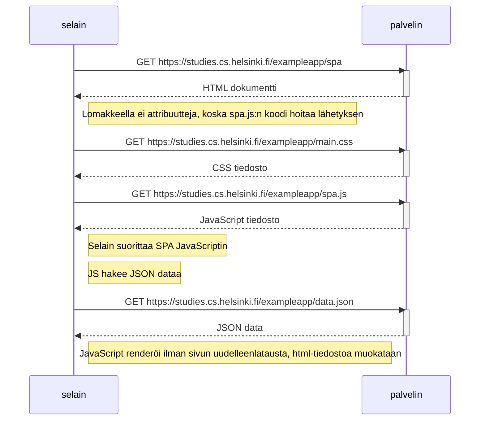

```mermaid
sequenceDiagram
    participant selain
    participant palvelin
    
    selain->>palvelin: GET https://studies.cs.helsinki.fi/exampleapp/spa
    activate palvelin
    palvelin-->>selain: HTML dokumentti
    deactivate palvelin

    Note right of selain: Lomakkeella ei attribuutteja, koska spa.js:n koodi hoitaa lähetyksen
    
    selain->>palvelin: GET https://studies.cs.helsinki.fi/exampleapp/main.css
    activate palvelin
    palvelin-->>selain: CSS tiedosto
    deactivate palvelin
    
    selain->>palvelin: GET https://studies.cs.helsinki.fi/exampleapp/spa.js
    activate palvelin
    palvelin-->>selain: JavaScript tiedosto
    deactivate palvelin
    
    Note right of selain: Selain suorittaa SPA JavaScriptin

    Note right of selain: JS hakee JSON dataa 
    
    selain->>palvelin: GET https://studies.cs.helsinki.fi/exampleapp/data.json
    activate palvelin
    palvelin-->>selain: JSON data
    deactivate palvelin   

    Note right of selain: JavaScript renderöi ilman sivun uudelleenlatausta, html-tiedostoa muokataan
```
