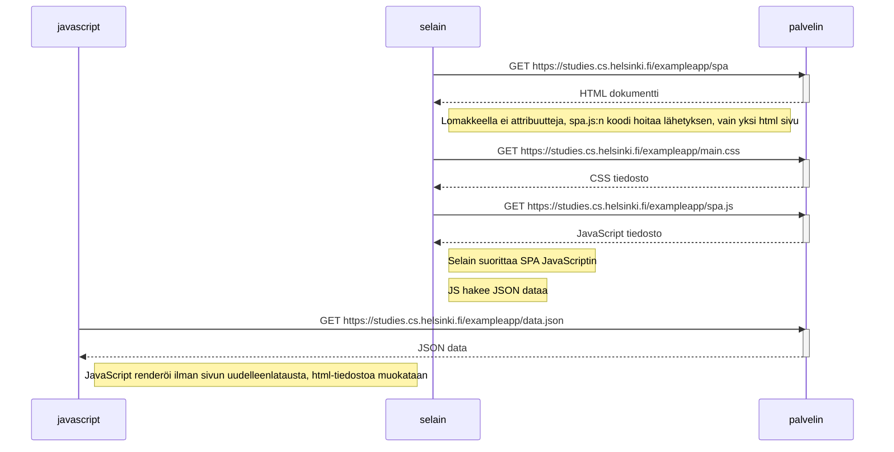

# FSO Osa 0 - 0.5 - Single Page App
### Kun käyttäjä menee exampleapp:in SPA osoitteeseen

```mermaid
sequenceDiagram
    participant javascript
    participant selain
    participant palvelin
    
    selain->>palvelin: GET https://studies.cs.helsinki.fi/exampleapp/spa
    activate palvelin
    palvelin-->>selain: HTML dokumentti
    deactivate palvelin

    Note right of selain: Lomakkeella ei attribuutteja, spa.js:n koodi hoitaa lähetyksen, vain yksi html sivu
    
    selain->>palvelin: GET https://studies.cs.helsinki.fi/exampleapp/main.css
    activate palvelin
    palvelin-->>selain: CSS tiedosto
    deactivate palvelin
    
    selain->>palvelin: GET https://studies.cs.helsinki.fi/exampleapp/spa.js
    activate palvelin
    palvelin-->>selain: JavaScript tiedosto
    deactivate palvelin
    
    Note right of selain: Selain suorittaa SPA JavaScriptin

    Note right of selain: JS hakee JSON dataa 
    
    javascript->>palvelin: GET https://studies.cs.helsinki.fi/exampleapp/data.json
    activate palvelin
    palvelin-->>javascript: JSON data
    deactivate palvelin   

    Note right of javascript: JavaScript renderöi ilman sivun uudelleenlatausta, html-tiedostoa muokataan
```
