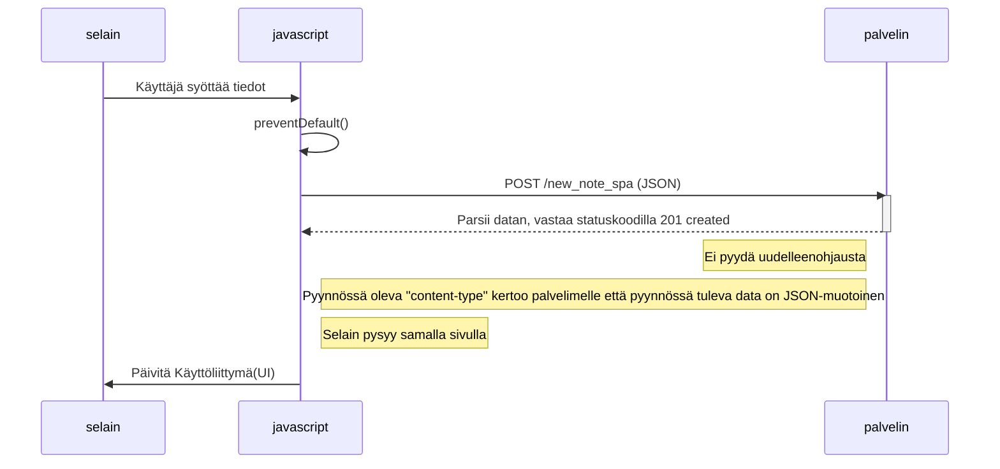

# FSO Osa 0 - 0.6 - Uusi muistiinpano
### Diagram SPA sivusta kun luodaan uusi muistiinpano

```mermaid
sequenceDiagram
    participant selain
    participant javascript
    participant palvelin
    
    selain->>javascript: Käyttäjä syöttää tiedot
    javascript->>javascript: preventDefault()
    javascript->>palvelin: POST /new_note_spa (JSON)
    activate palvelin
    palvelin-->>javascript: Parsii datan, vastaa statuskoodilla 201 created
    deactivate palvelin

    note left of palvelin: Ei pyydä uudelleenohjausta

    note right of javascript: Pyynnössä oleva "content-type" kertoo palvelimelle että pyynnössä tuleva data on JSON-muotoinen 
    note right of javascript: Selain pysyy samalla sivulla

    
    javascript->>selain: Päivitä Käyttöliittymä(UI)    
```
